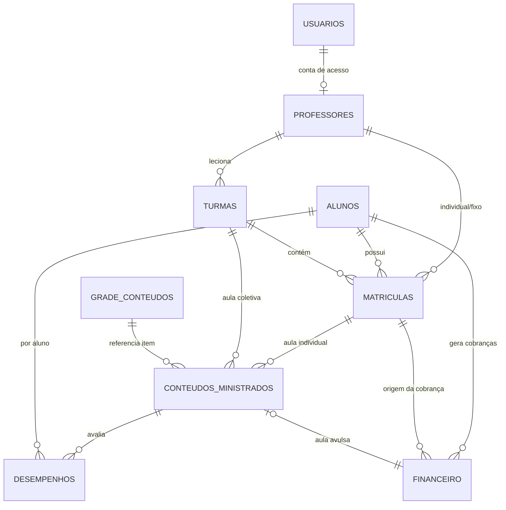

# Sistema de Gestão — Escola de Música

## 1. Visão Geral

Aplicação web para gerenciar uma escola de música com turmas coletivas e aulas individuais.

- **Hospedagem:** Netlify (plano gratuito) — site estático + funções serverless
- **Banco de dados:** Supabase (PostgreSQL, plano gratuito)
- **Stack:** HTML + CSS + JavaScript (front) · Netlify Functions + PostgreSQL (back)

---

## 2. Perfis de Usuário

| Perfil | Acesso | Responsabilidades |
|---|---|---|
| **Admin** | Total | Cadastros, turmas, financeiro, relatórios, configuração da grade |
| **Professor** | Parcial | Lança aulas e conteúdos das suas turmas e alunos, registra desempenho. Sem acesso ao financeiro |

### Permissões (matriz)

| Recurso | Admin | Professor |
|---|---|---|
| Cadastro de professores | CRUD | — |
| Cadastro de alunos | CRUD | Visualiza seus alunos |
| Turmas / matrículas | CRUD | Visualiza suas turmas |
| Grade de conteúdos | CRUD | Visualiza |
| Lançamento de aulas | CRUD | **CRUD (suas turmas/alunos)** |
| Financeiro | Total | Negado |
| Relatórios e gráficos | Total | Desempenho das suas turmas/alunos |

---

## 3. Requisitos Funcionais

### Módulo A — Autenticação e Perfis
- **RF01** Login com e-mail e senha (Admin e Professor).
- **RF02** Controle de permissão por perfil (matriz acima).
- **RF03** Professor vinculado a uma conta de usuário (ou admin cria o acesso).
- **RF04** Troca de senha.

### Módulo B — Cadastro de Professores
- **RF05** Cadastro, edição, inativação e listagem de professores (nome, instrumento, e-mail, telefone, formação).
- **RF06** Vincular professor a uma conta de acesso (usuário).

### Módulo C — Cadastro de Alunos
- **RF07** Cadastro, edição, inativação e listagem de alunos (nome, telefone, e-mail, observações).
- **RF08** Aluno pode ter **turma**, **aula individual**, ou **ambas** (matrículas independentes).

### Módulo D — Turmas e Matrículas
- **RF09** Cadastro de turma (nome, instrumento, professor, dia/horário, valor mensal, status ativa/encerrada).
- **RF10** Matricular aluno em turma coletiva → status `ativa | trancada | concluida`.
- **RF11** Matrícula individual: aluno + professor responsável + valor da aula.
- **RF12** Cada turma tem seu **próprio** controle de conteúdo (independente das demais).
- **RF13** Encerramento/trancamento de matrícula (sem apagar histórico).

### Módulo E — Grade de Conteúdos (padrão)
- **RF14** Cadastro da grade padrão: itens ordenados (título, descrição, módulo, nível, tempo estimado).
- **RF15** A grade é **única** e serve de base para turmas e individuais (quem é individual apenas avança mais rápido).
- **RF16** Editar/desativar itens da grade sem apagar registros já ministrados.

### Módulo F — Conteúdo Programático (lançamento de aulas)
- **RF17** Professor lança aula/atividade para uma **turma** (conteúdo dado na data X).
- **RF18** Professor lança aula/atividade para **aluno individual**.
- **RF19** Aula pode referenciar um item da grade ou ser conteúdo livre.
- **RF20** Registrar **evolução da turma** na aula (%). 
- **RF21** (Opcional) Registrar desempenho **por aluno dentro da turma** — base do gráfico individual.
- **RF22** Listar progresso: o que já foi ministrado (concluído) vs. o que falta da grade por turma/aluno.

### Módulo G — Financeiro
- **RF23** Cobrança de **mensalidade**: geração automática de lançamento todo mês por matrícula ativa.
- **RF24** Cobrança de **aula avulsa**: geração automática de lançamento ao lançar uma aula avulsa (valor da aula da matrícula).
- **RF25** Tela **A receber**: lançamentos pendentes — atual + previsão futura.
- **RF26** Tela **Recebidos**: baixar pagamento (data pago, forma: PIX/cartão/dinheiro/boleto).
- **RF27** Sinalização de **inadimplência**: pendente com vencimento em atraso (dias de atraso).
- **RF28** Resumo mensal: previsto vs. recebido por competência.
- **RF29** Ajustes manuais (lançamento avulso, desconto, cancelamento).
- **RF30** Acesso financeiro **somente Admin**.

### Módulo H — Relatórios e Gráficos
- **RF31** Gráfico de **desempenho da turma** ao longo do tempo (média de evolução por aula).
- **RF32** Gráfico de **desempenho por aluno** (evolução individual por aula/conteúdo).
- **RF33** Gráfico financeiro: **previsto vs. recebido** por mês.
- **RF34** Lista de inadimplentes (aluno, valor, vencimento, dias de atraso).
- **RF35** Exportação simples (CSV) dos principais relatórios.

---

## 4. Requisitos Não Funcionais

- **RNF01** Responsivo (mobile + desktop).
- **RNF02** Segurança: autenticação + **Row Level Security (RLS)** no banco — cada perfil vê apenas seus dados.
- **RNF03** Custo: permanecer nos planos gratuitos Netlify + Supabase.
- **RNF04** Backup automático do Supabase (há opção no plano free) + exportação local.
- **RNF05** Performance: carregar relatórios via **views SQL** no banco (não filtrar tudo no front).
- **RNF06** LGPD: dados pessoais de alunos tratados como sensíveis; acesso restrito.

---

## 5. Regras de Negócio (RN)

- **RN01** Toda matrícula ativa do tipo **mensal** gera **uma** cobrança por competência (mês) — valor do plano da matrícula.
- **RN02** Matrícula do tipo **avulsa** não gera mensalidade; a cobrança é criada **automaticamente** quando o professor lança uma aula avulsa para o aluno.
- **RN03** Professor enxerga somente turmas/alunos onde está vinculado.
- **RN04** Financeiro é exclusivo do Admin.
- **RN05** Desempenho/evolução é percentual 0–100.
- **RN06** A grade padrão é compartilhada; **o progresso é por turma/aluno** (cada um marca seus concluídos).
- **RN07** Aluno pode ter regime **mensal** em uma turma e regime **avulsa** no individual, simultaneamente (decisão registrada por matrícula).
- **RN08** Excluir registros **nunca apaga** financeiro já lançado — lançamento cancelado fica com status `cancelada`.
- **RN09** Atrasado = `pendente` com `vencimento < hoje`.

---

## 6. Avaliação — Cobrança de Aula Avulsa

**Modelo proposto:** o regime é definido **por matrícula** (`tipo_pagamento`). O professor lança a aula → o sistema cria automaticamente o lançamento financeiro `aula_avulsa` com o `valor_aula` da matrícula.

**Recomendação de implementação (fases):**
1. **MVP:** entregar apenas o regime **mensal** (mais previsível, cobre ~90% das matrículas).
2. **Fase 2:** implementar **avulsa** (campo `valor_aula` + geração automática ao lançar aula).

**Vantagens da avulsa:** flexibilidade de horário, atrai alunos em teste, receita proporcional ao esforço dado, atende aula individual de alta demanda.
**Desvantagens:** receita imprevisível, mais lançamentos para controlar, risco de evasão entre aulas, cobrança manual frequente.

**Conclusão:** manter **mensal como padrão**; avulsa restrita a matrículas **individuais**. Assim o controle fica simples e o sistema já nasce preparado para as duas modalidades.

---

## 7. Diagrama Entidade-Relacionamento (ERD)

---

## 8. Especificação das Tabelas

| Tabela | Finalidade | Campos principais |
|---|---|---|
| `usuarios` | Login e perfis | nome, email (único), senha_hash, perfil (`admin`/`professor`), ativo |
| `professores` | Cadastro | usuario_id (opc.), nome, instrumento, email, telefone, formacao, ativo |
| `alunos` | Cadastro | nome, telefone, email, observacao, ativo |
| `turmas` | Turmas coletivas | nome, instrumento, professor_id, dia_semana, horario, valor_mensal, status |
| `matriculas` | Vínculo aluno↔turma/individual | aluno_id, turma_id (opc.), tipo (`turma`/`individual`), professor_id (individual), tipo_pagamento (`mensal`/`avulsa`), valor_mensal, valor_aula, status, data_inicio |
| `grade_conteudos` | Grade padrão | titulo, descricao, modulo, nivel, ordem, tempo_estimado, ativo |
| `conteudos_ministrados` | Aulas dadas | turma_id/aluno vínculo, professor_id, grade_id (opc.), data_aula, titulo, descricao, evolucao_turma (%), observacoes |
| `desempenhos` | Nota por aluno (opcional) | aluno_id, conteudo_id, desempenho (0–100), avaliacao, data |
| `financeiro` | Lançamentos (a receber/recebidos) | aluno_id, matricula_id (opc.), tipo (`mensalidade`/`aula_avulsa`/`ajuste`), descricao, valor, vencimento, competencia, status (`pendente`/`paga`/`atrasada`/`cancelada`), data_pagamento, forma_pagamento |

---

## 9. Views dos Relatórios

- `vw_desempenho_turma` — média de evolução por turma ao longo do tempo (gráfico RF31).
- `vw_desempenho_aluno` — evolução por aluno (gráfico RF32).
- `vw_financeiro_resumo` — previsto (pendente) vs. recebido (pago) por competência (gráfico RF33 e RF28).

Detalhe em SQL no arquivo `SCHEMA.sql`.

---

## 10. Próximos Passos

1. **Etapa 1:** preparar ambiente (GitHub + Netlify + Supabase) e subir "Olá mundo".
2. **Etapa 2:** aplicar `SCHEMA.sql`, criar autenticação e RLS.
3. **Etapa 3 (MVP):** cadastros (professor/aluno/turma) + matrículas.
4. **Etapa 4:** grade + lançamento de aulas (sem financeiro).
5. **Etapa 5:** financeiro (mensal primeiro; avulsa na fase 2).
6. **Etapa 6:** gráficos e relatórios.